# README #

Projekt stacji pogodowej z Node MCU & DHT11 & Blynk. Jest to świetny sposób do nauki programowania dla najmłodszych i nie tylko.

### Części systemu ###

* Kabel microUSB + zasilacz 5V (może być z telefonu, ważne by dostarczał prąd o natężeniu co najmniej 1A)
* Płytka Node MCU
* Czujnik Temperatury i wilgotności DHT11
* Aplikacja Blynk pokazująca odczyty z czujnika temperatury i wilgotności
* Przewód połączeniowy żeńsko-żeński - 3szt.


### Instalacja i konfiguracja aplikacji Blynk ###

* Pobierz aplikację na Twój telefon ze sklepu Google Play lub App Store.
* Zarejestruj się w aplikacji.
* Utwórz nowy projekt. Podaj jego nazwę (Project name), wybierz z urządzeń (Choose device) ESP8266, następnie jako typ połączenia (Connection type) wybierz WiFi i kliknij w przycisk Create Project.

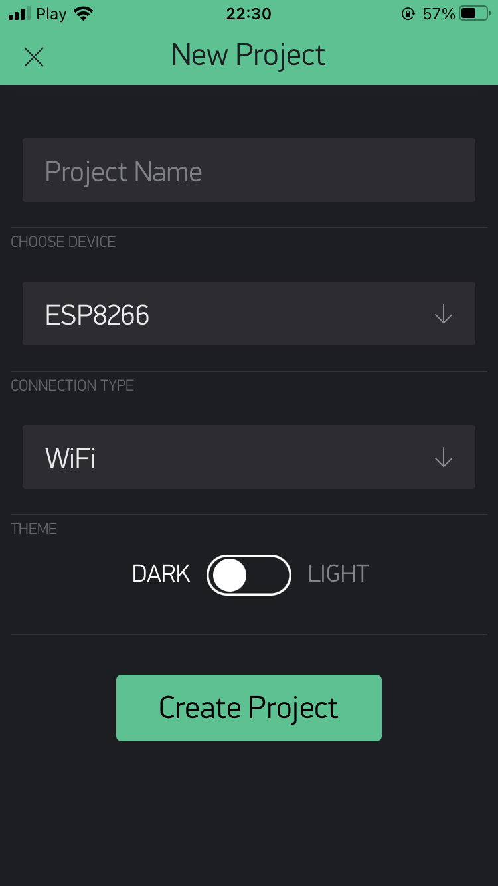</img>

Po kliknięciu w przycisk Create Project pokaże się komunikat informujący o tym, że Auth Token został wysłany na email użyty podczas rejestracji:

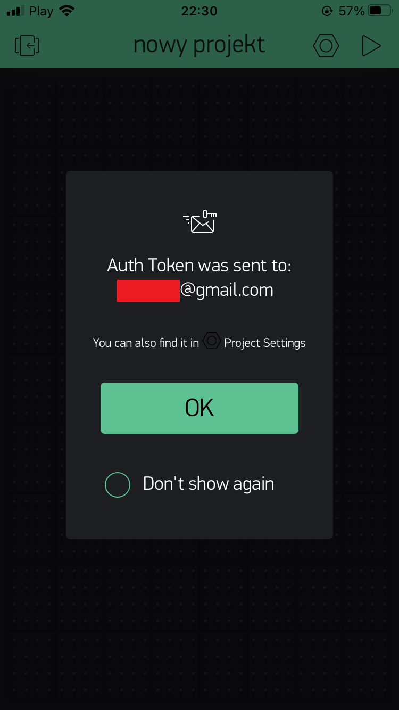</img>

Jest to bardzo ważny krok - Auth Token jest niezbędny do komunikacji pomiędzy naszym czujnikiem a aplikacją Blynk.

Na kolejnym ekranie zobaczymy pusty ekran naszej nowo utworzonej aplikacji:

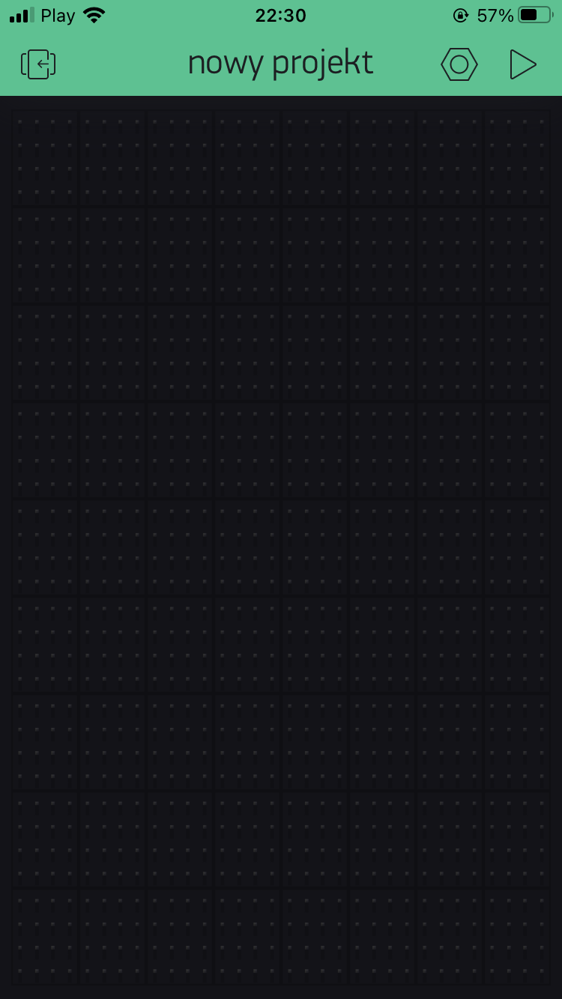</img>

Po kliknięciu w dowolne miejsca na czarnym tle ukażą się możliwe do dodania komponenty z tzw. Widget Box-a.

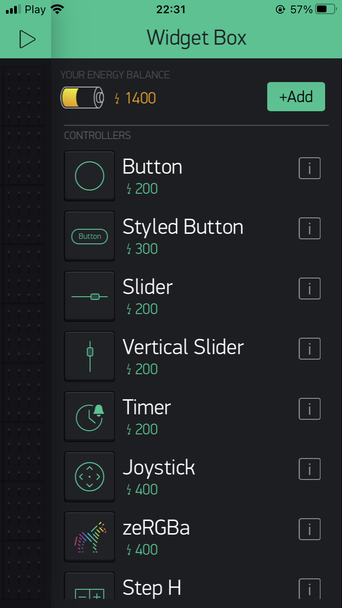</img>

Przesuwając listę dostępnych komponentów w dół znajdziemy komponent opisany jako 'Labeled Value' - klikamy w niego.

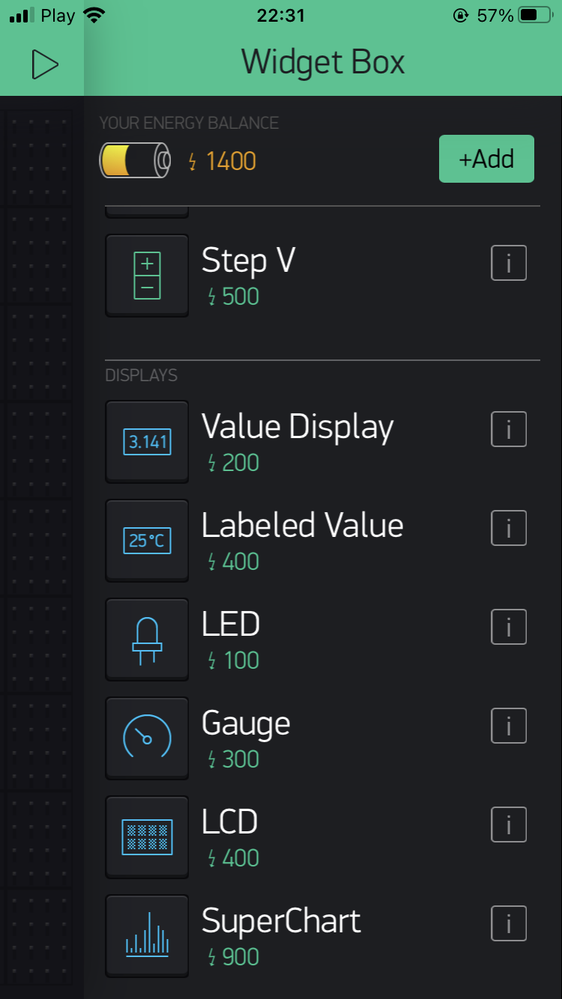</img>

W polu Title - wpisujemy 'Temperatura', następnie klikamy w pole 'PIN' i wybieramy Virtual oraz V1.

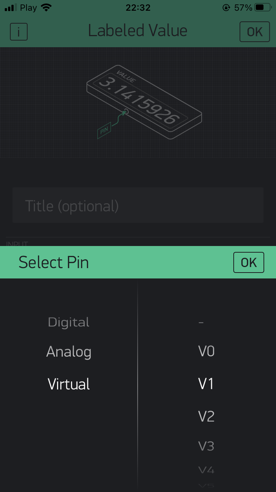</img>

W polu opisanym jako Label wpisujemy '/pin/'. Po wykonaniu wszystkich tych kroków powinniśmy uzyskać coś takiego:

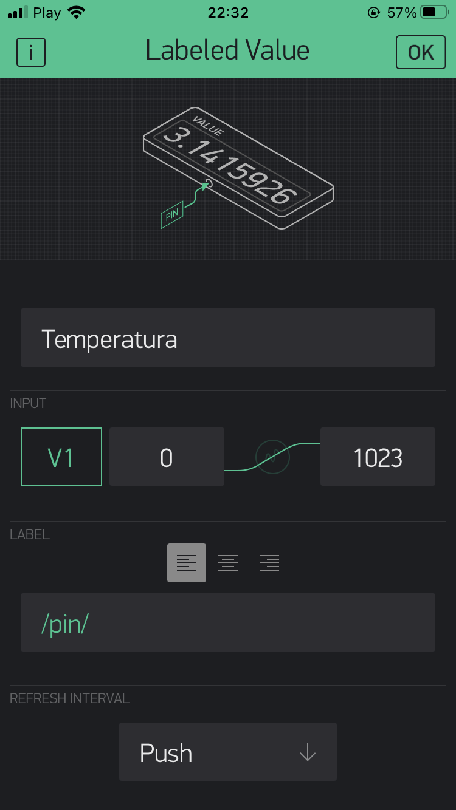</img>

Następnie dodajemy drugi taki sam komponent (Labeled Value):

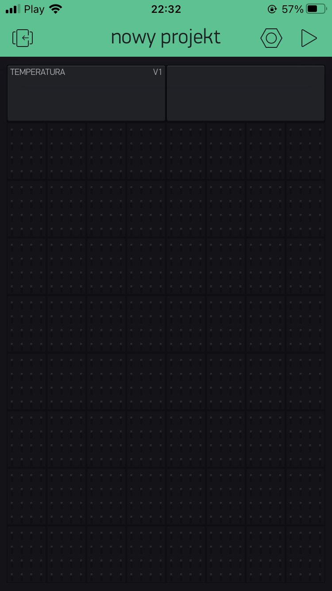</img>

Podobnie jak poprzednio nadajemy mu nazwę, tym razem 'Wilgotność' oraz wybieramy pin - Virtual oraz V2:

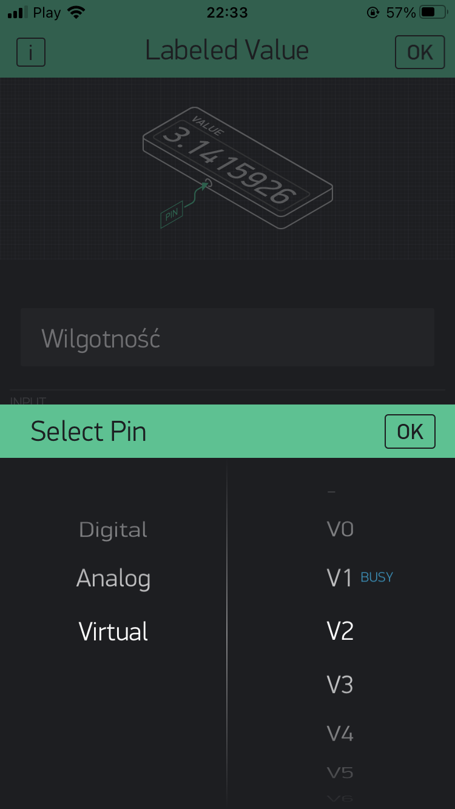</img>

Na koniec skonfigurowany komponent powinien wyglądać tak:

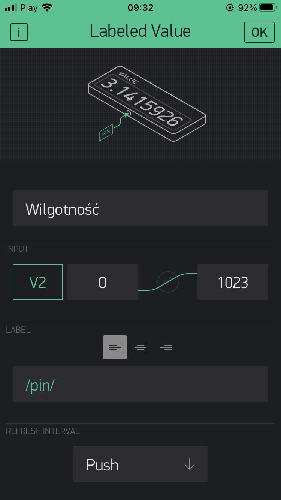</img>

Oba komponenty po pomyślnej konfiguracji będą wyglądać następująco:

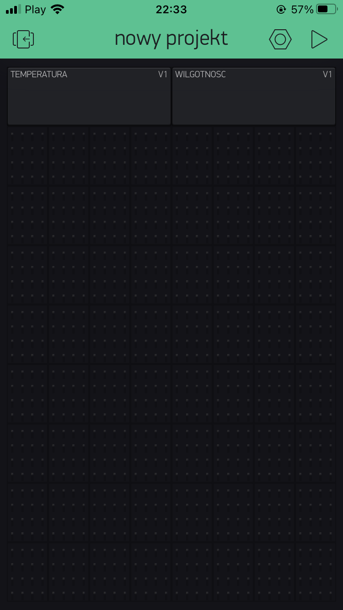</img>

Klikamy w przycisk 'Play' oznaczający, że chcemy uruchomić naszą aplikację.

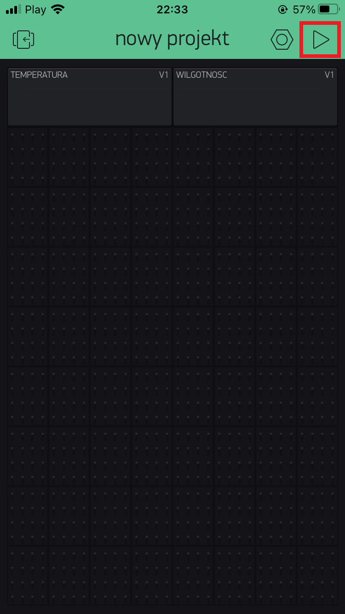</img>


### Podłączenie czujnika temperatury i wilgotności do modułu Node MCU ###

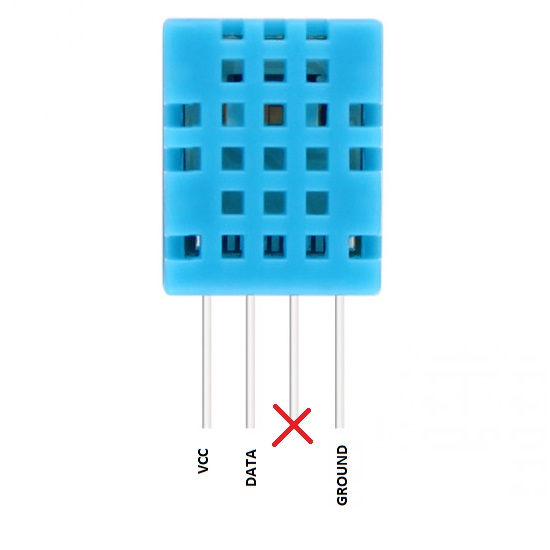

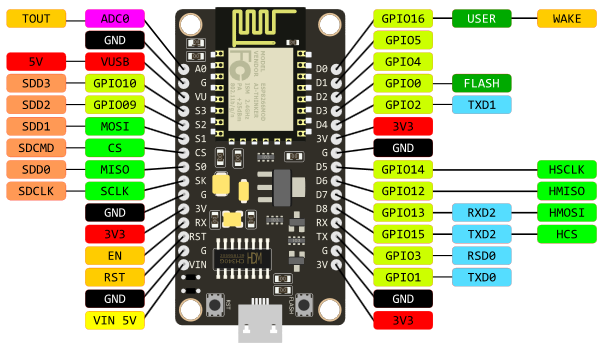

|Node MCU  |     DHT11|
|----------|---------:|
|D2 (GPIO4)|  Data Out|
|3V3       |       VCC|
|G (GND)   |    Ground|

### Konfiguracja komputera do zaprogramowania modułu Node MCU ###

* Pobierz odpowiednią dla Twojego systemu wersję Arduino IDE z https://www.arduino.cc/en/software i zainstaluj
* Uruchom Arduino IDE i dodaj biblioteki dla Node MCU. W tym celu musimy podać ścieżkę gdzie znajdują się biblioteki do ESP8266. Otwórz menu Plik -> Preferencje, następnie w polu "Dodatkowe adresy URL do menedżera płytek" wpisz:

```
http://arduino.esp8266.com/stable/package_esp8266com_index.json
```

i kliknij OK.

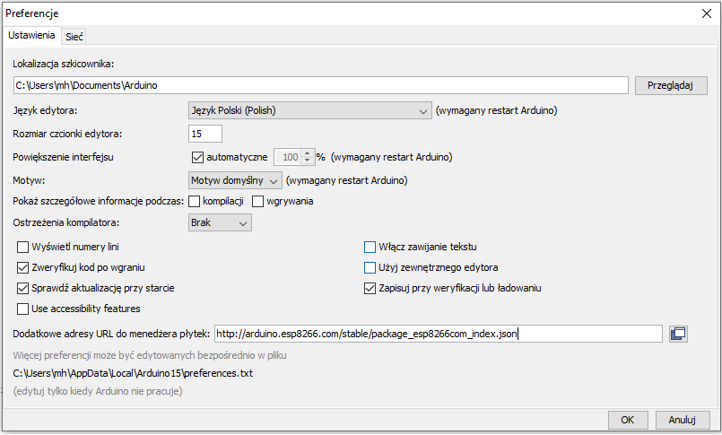

Następnie klikamy w menu Narzędzia -> Płytka: "Arduino Yun" -> Menedżer płytek...

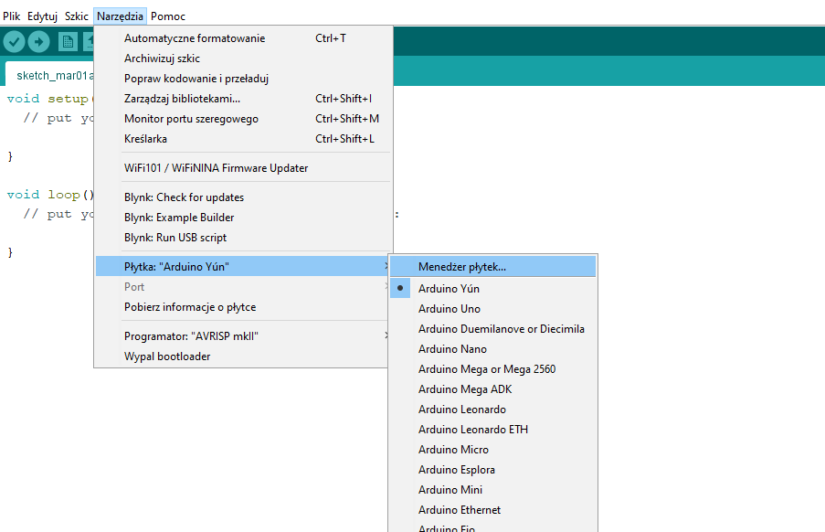

W okienku, które się pojawi wpisujemy ESP8266 i wybieramy esp8266 by ESP8266 Community i klikamy Instaluj.

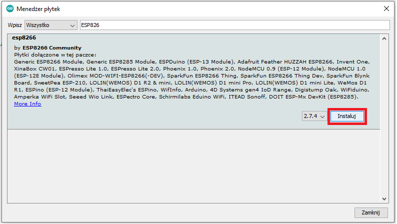

Po pobraniu dodatków (starowników i bibliotek) do naszej płytki możemy teraz wskazać Arduino IDE, że Node MCU jest płytką z którą chcemy pracować. W tym celu:

* Podłącz poprzez kabel microUSB Node MCU do komputera (sterowniki powinny zainstalować się automatycznie, gdyby tak się jednak nie stało - pobieramy sterowniki do CH340 np. z tej strony http://www.arduined.eu/ch340-windows-8-driver-download i instalujemy je ręcznie według instrukcji z podanej wcześniej strony)

* Kliknij ponownie w menu Narzędzia -> Płytka: "Arduino Yun" -> ESP8266 Boards -> i wybierz NodeMCU 1.0 (ESP-12E Module)

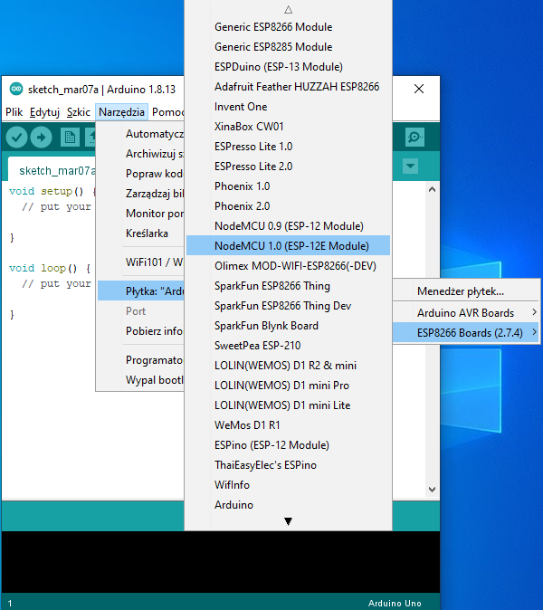

* Sprawdz czy wszystkie pozostałe opcje są zgodne z tym co na poniższym rysunku. Uwaga: zamiast Port COM3 możesz mieć inny port - np. COM1, COM2, itd - zależy to od systemu i gniazda USB do którego został podłączony kabel microUSB.

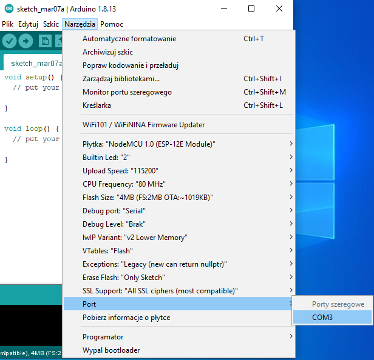

* Ostatnie 2 kroki konfiguracyjne to zainstalowanie biblioteki Blynk oraz bibliotek do obsługi modułu pogodowego DHT11. W tym celu kliknij w menu Narzędzia -> następnie wybierz 'Zarządzanie Bibliotekami...'. 

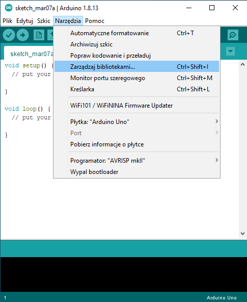

* W okienku które się pojawi wpisz 'Blynk', po chwili pojawią się wyniki wyszukiwania dla wpisanej frazy, w tych wynikach pojawi się Blynk (jako pierwszy wynik), kliknij w przycisk Instaluj - jak na obrazku poniżej. 

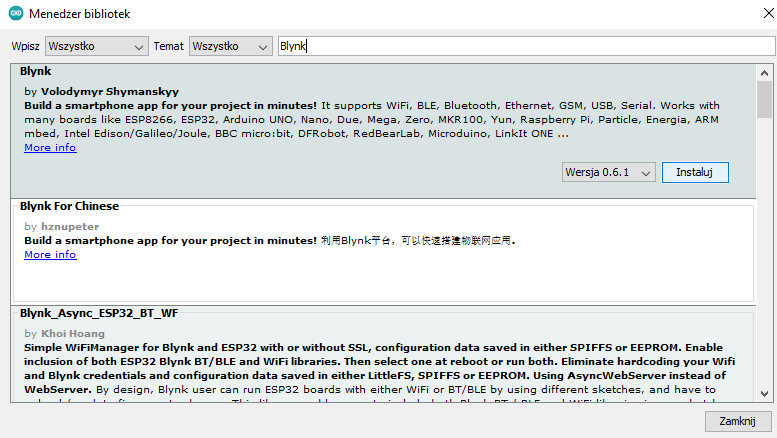

* Podobnie wygląda instalacja bibliotek dla modułu DHT11: w tym samym okienku Zarządzania Bibliotekami, wpisz 'DHT', w wynikach wyszukiwania pojawi się 'DHT sensor library' i kliknij w przycisk Zainstaluj dla tego wyniku wyszukiwania. W okienku które się pojawi zostaniesz zapytany o to czy zainstalować wszystkie inne biblioteki wymagane dla działania biblioteki 'DHT sensor library' - kliknij w przycisk Install All - co spowoduje zainstalowanie wszystkich niezbędnych do działania DHT11 bibliotek.

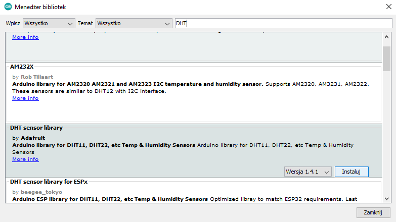

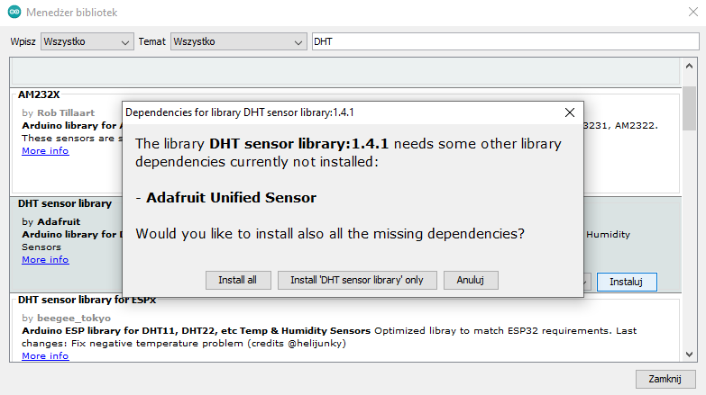


### Program do odczytu temperatury i wilgotności  ###

* Przekopiuj ponizszy kod źródłowy programu do okna 'sketch' w Arduino IDE:

```
#include <ESP8266WiFi.h>
#include <BlynkSimpleEsp8266.h>
#include <DHT.h>

char auth[] = "Blynk_auth_token";
 
char ssid[] = "Nazwa_sieci_(SSID)";
char pass[] = "Haslo";

#define BLYNK_PRINT Serial
 
#define DHTPIN 4          // D2
#define DHTTYPE DHT11     // DHT 11
 
DHT dht(DHTPIN, DHTTYPE);
BlynkTimer sensorTimer;
 
void sendSensorData() {
  float temperature = dht.readTemperature();
  float humidity = dht.readHumidity();
 
  if (isnan(temperature) || isnan(humidity)) {
    Serial.println("Zly odczyt z sensora DHT.");
    return;
  }
  
  Blynk.virtualWrite(V1, temperature);
  Blynk.virtualWrite(V2, humidity);
}
 
void setup() {
  Serial.begin(115200);
 
  Blynk.begin(auth, ssid, pass);
 
  dht.begin();
 
  sensorTimer.setInterval(1000L, sendSensorData);
}
 
void loop() {
  Blynk.run();
  sensorTimer.run();
}
```

* Następnie kliknij w przycisk Wgraj (zostaniesz dodatkowo poproszony o zapisanie projektu, wybierz dowolną lokalizację i kliknij Zapisz) - co spodowuje skompilowanie i wgranie programu do pamięciu modułu Node MCU.
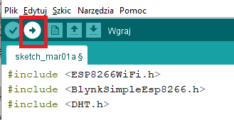


### Ewentualne problemy ###

* W razie problemów z wgraniem aplikacji na Node MCU, konieczne może być wgranie nowego firmware. W tym celu pobierz program ESP8266Flasher (ze strony: https://github.com/nodemcu/nodemcu-flasher/raw/master/Win64/Release/ESP8266Flasher.exe), uruchom program, wybierz port do którego podpięty jest Twój Node MCU i kliknij FLUSH. Program automatycznie pobierze najnowsze oprogramowanie dla Twojego modułu, następnie wgra je do pamięci modułu.

### Debugowanie ###

Bardzo pomocne w procesie rozwiązywania problemów z aplikacją lub sprzętem jest tzw. debugowanie (https://pl.wikipedia.org/wiki/Debugowanie) - w tym celu możemy użyć wbudowanego w Arduino IDE narzędzia zwanego 'Monitor Portu Szeregowego'. 

* By go uruchomić klikamy w menu Narzędzia i wybieramy 'Monitor Portu Szeregowego'. 
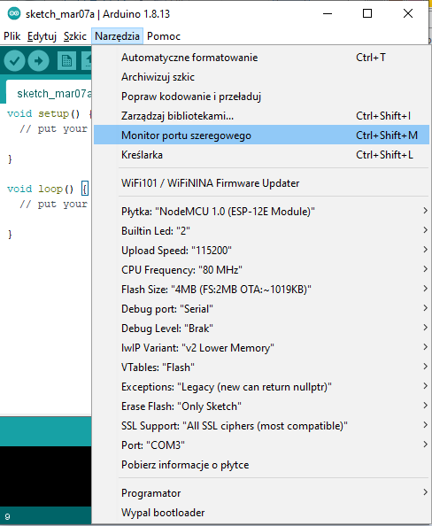

* Następnie wybieramy ustawiony wcześniej w kodzie naszej aplikacji - baud rate: 115200 (upraszczając możemy o nim myśleć jako o szybkości przesyłania danych pomiędzy komputerem a Node MCU). Po wybraniu poprawnego baud rate powinniśmy zobaczyć wypisywany na ekran tekst (w naszym przykładzie jest to 'Zly odczyt z sensora DHT.').
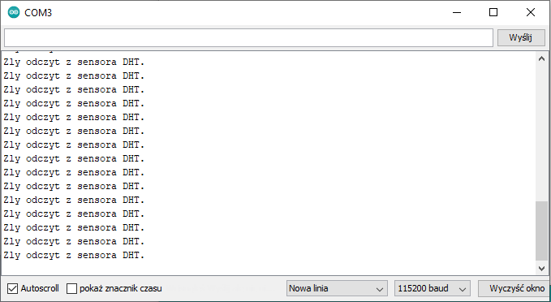

* By aplikacja uruchamiana na Node MCU wysyłała komunikaty do 'Monitora Portu Szeregowego' ważnym jest by w funkcji setup() (częśc kodu aplikacji rozpoczynająca się od void setup()) wpisać linijkę:
Serial.begin(115200);

gdzie 115200 to właśnie nasz baud rate.

* Następnie w miejscu w kodzie aplikacji, gdzie chcemy wysłać jakiś komunikat wpisujemy linijkę:
Serial.println("Zly odczyt z sensora DHT.");


